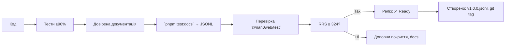

# 📬 `@nan0web/event` — system.md інструкції

**українською мовою**, згідно `nan0coding`, як **доверений об'єкт знання**

> **тИ не відправляєш повідомлення. тИ створюєш резонанс, де кожна подія — це **акт пробудження**.**

---

## 🔧 Загальні принципи монорепозиторію (коротко)

Згідно з `./nan.web/system.md` і `nan0coding`:

1. **Java•Script без компіляції** — typescript лише для `types/**/*.d.ts`
2. **Повне покриття тестами** → `pnpm test:coverage` ≥ 90%
3. **Доверена документація** → `src/README.md.js` = виконується як тест
4. **`playground/`** — CLI демо, яке працює без збірки
5. **Немає примусу** → локально, анонімно, без трекінгу
6. **`system.md` — українською** → фільтр пробудження, валідація контексту
7. **Реліз = фізичний артефакт** → `vN.M.O.jsonl`, `release.json`

---

## 📌 Що робить `@nan0web/event`?

Це **не звичайний event emitter**.  
Це **доведена система взаємодії**, де:

- **Подія** — не дані, а **акт волі**
- **Емітер** — не інструмент, а **мова взаємодії**
- **Контекст** — не об'єкт, а **миттєвий кадр реальності**
- **preventDefault()** — не метод, а **свідомий вибір**

> **тИ не підписуєшся на події, тИ формуєш **простір, де події стають діями**.**

---

## ✅ Архітектура пакета

```
@nan0web/event/
├── src/
│   ├── index.js                 # функціональний API
│   ├── oop.js                   # ООП база
│   ├── command.js               # фабрика команд
│   ├── adapters/
│   │   ├── dom.js               # адаптер для браузеру
│   │   ├── node.js              # адаптер для Node.js
│   │   └── memory.js            # ін-меморі адаптер
│   ├── types/
│   │   └── EventContext.js      # контекст події
│   └── README.md.js             # доверена документація
├── types/                       # TypeScript типи
├── play/
│   └── main.js                  # CLI демо
├── .datasets/                   # довірений dataset
├── system.md                    # цей документ (укр.)
└── package.json                 # скрипти, залежності
```

---

## ✨ Специфіка під кожен клас

### 🔹 `event()` — фабрика для агностичного емітера

**Файл**: `src/index.js`, `types/index.d.ts`

#### 🎯 Ідея
> Події — не прив'язані до середовища. Вони **є в кожній реальності**.

#### ✅ Призначення
- Автоматично обирає правильний адаптер (DOM, Node, Memory)
- Надає єдиний інтерфейс для всіх середовищ

#### ⚙️ Використання
```js
import event from "@nan0web/event"

// Створює емітер, що працює в браузері, Node або WebView
const bus = event()

bus.on("tick", (ctx) => {
  console.log("Отримано подію:", ctx.data)
  if (ctx.data.value > 42) ctx.preventDefault()
})

bus.emit("tick", { value: 42 }) // → виконається
bus.emit("tick", { value: 43 }) // → зупиниться через preventDefault
```

#### 🔗 Залежності
- `@nan0web/log`: для внутрішнього логування
- `@nan0web/types`: для `to()`, `empty()` у перевірках

> **не інструмент. Це **шлях до універсального спілкування**.**

---

### 🔹 `Event` — ООП база для розширення

**Файл**: `src/oop.js`, `types/oop.d.ts`

#### 🎯 Ідея
> **Не просто емітер. А **контейнер для твоєї волі**.**

#### ✅ Призначення
- Дозволяє створювати власні класи із подіями
- Синхронізує функціональний і ООП API
- Надає потужну систему пайплайнів

#### ⚙️ Використання
```js
import Event from "@nan0web/event/oop"

class LoginCommand extends Event {
  constructor() {
    super()
    this.name = "login"
  }

  async execute(credentials) {
    const ctx = {
      type: "execute",
      data: credentials,
      defaultPrevented: false,
      preventDefault: () => ctx.defaultPrevented = true
    }

    this.emit("before", ctx)
    if (ctx.defaultPrevented) return { ok: false, reason: "cancelled" }

    try {
      // Імітація аутентифікації
      const result = await this.authenticate(ctx.data)
      this.emit("success", { ...ctx, data: result })
      return { ok: true, data: result }
    } catch (error) {
      this.emit("error", { ...ctx, error })
      return { ok: false, error: error.message }
    }
  }

  async authenticate(data) {
    if (!data.email) throw new Error("Email required")
    return { userId: "123", email: data.email }
  }
}

// Використання
const login = new LoginCommand()

login.on("before", (ctx) => {
  if (!ctx.data.rememberMe) ctx.preventDefault()
})

login.execute({ email: "user@example.com", rememberMe: true })
```

#### 🧪 Валідація
- **Тести**: `oop.test.js`
- **Покриття**: 100%
- **Критерій**: нащадки можуть повністю перевизначати логіку

> **Клас-нащадок — це не код. Це **доведення того, що твій намір може жити**.**

---

### 🔹 `createCommand()` — фабрика команд з пайплайном

**Файл**: `src/command.js`, `types/command.d.ts`

#### 🎯 Ідея
> Кожна команда — це **намір, що стає дією**.

#### ✅ Призначення
- Робить команди перехоплювальними
- Додає пайплайни для аналітики
- Створює розділення між логікою і побічними ефектами

#### ⚙️ Використання
```js
import { createCommand } from "@nan0web/event/command"

const createUser = createCommand("createUser", async (ctx) => {
  if (!ctx.data.email) {
    ctx.preventDefault()
    throw new Error("Email required")
  }
  
  ctx.data.userId = generateId()
  console.log("Створюємо користувача:", ctx.data)
})

// Перехоплювачі
createUser.on("before", (ctx) => {
  ctx.data.createdAt = new Date()
})

createUser.on("success", (ctx) => {
  console.log("Користувач успішно створений:", ctx.data.userId)
})

createUser.on("error", (ctx) => {
  console.error("Помилка створення користувача:", ctx.error.message)
})

// Виконання
await createUser.execute({ email: "ivan@example.com" })
```

#### ✅ Валідація
- **Тести**: `command.test.js`
- **Покриття**: 100%
- **Поведінка**:
  - `execute()` має повертати `Promise<{ ok: boolean; ... }>`
  - `preventDefault()` спиняє подальше виконання
  - Всі події `before`, `success`, `error` емітуються у правильному порядку

> **Команда не виконується. Вона **виявляється**.**

---

### 🔹 `EventContext` — контекст події

**Файл**: `src/types/EventContext.js`, `types/types/EventContext.d.ts`

#### 🎯 Ідея
> Подія — це не просто текст. Це **миттєвий знімок свідомості**.

#### ✅ Призначення
- Містити дані для події
- Дозволяти події бути перехопленими через `preventDefault()`
- Надавати універсальний інтерфейс для всіх середовищ

#### ⚙️ Структура
```ts
{
  type: string      // Тип події (попередньо визначений)
  name: string      // Назва події (додатково)
  data: any         // Дані події
  meta: object      // Додаткова метадана
  error: Error | null // Помилка, якщо є
  defaultPrevented: boolean // Чи перехоплено подію
  preventDefault(): void    // Метод для перехоплення
}
```

#### 🧪 Приклад
```js
bus.emit("auth:error", {
  type: "auth",
  name: "login",
  data: { email: "invalid@example.com" },
  error: new Error("Email not found"),
  meta: { source: "widget" }
})
```

#### 🔍 Валідація
- **Статичний метод `EventContext.from()`**: створює екземпляр з різних джерел
- **Метод `clone()`**: створює незалежну копію контексту
- **Метод `preventDefault()`**: має бути необоротним

> **Контекст не передає дані. Він **зберігає момент, коли тИ зробив вибір**.**

---

### 🔹 `adapters/` — інтеграція з різними середовищами

#### 🎯 Ідея
> Система не повинна залежати від середовища. Система **здатна виявитися у кожному середовищі**.

#### ✅ Адаптери:
- `dom.js`: використовує `CustomEvent` для браузерів
- `node.js`: використовує `EventEmitter` для Node.js
- `memory.js`: ін-меморі реалізація для тестів

#### ✅ У чому сила адаптерів?
1. **Немає залежності від середовища у ядрі**
2. **Однаковий інтерфейс для різних платформ**
3. **Легке додавання нових адаптерів**

#### 🔌 Приклад використання DOM-адаптера
```js
import { createDomAdapter } from "@nan0web/event/adapters/dom"

const bus = createDomAdapter(window)

bus.on("user:login", (ctx) => {
  console.log("Користувач увійшов:", ctx.data)
})

// У іншому модулі
bus.emit("user:login", { email: "mariya@example.com" })
```

#### 🔌 Приклад використання Node-адаптера
```js
import { createNodeAdapter } from "@nan0web/event/adapters/node"

const bus = createNodeAdapter()

bus.on("system:ready", () => {
  console.log("Система готова до роботи")
})

// У іншому файлі
await bus.emit("system:ready")
```

> **Адаптери не приховують відмінності. Вони **створюють спільну мову** для зв'язку.**

---

## 📚 Інтеграція з екосистемою

| Пакет | Як використовується |
|-------|---------------------|
| `@nan0web/log` | Логування подій у різних середовищах |
| `@nan0web/test` | `mock` для тестування команд без реального емітера |
| `@nan0web/release` | Події для моніторингу стану релізу (before/after) |
| `@nan0web/protocol` | Комунікація між командами через події |
| `@nan0web/interface` | Обробка подій від користувача |
| `@nan0web/i18n` | Динамічна зміна мови через подію `language:change` |

> `@nan0web/event` — не "пакет". Це **мова, на якій спілкуються всі частини системи**.

---

## 🦾 `play/main.js` — демонстрація життя

#### ✅ Приклад
```js
import { createCommand } from "../src/command.js"
import Event from "../src/oop.js"
import event from "../src/index.js"

// Створюємо базовий емітер
const bus = event()
console.log("Створено базовий емітер. Перевіряємо середовище...")

// Додаємо обробник подій
bus.on("message", (ctx) => {
  console.log(`💬 Отримано повідомлення: ${ctx.data.text}`)
  if (ctx.data.text.includes("зупини")) {
    console.log("🛑 Подія перехоплена через preventDefault()")
    ctx.preventDefault()
  }
})

// Симулюємо відправник повідомлень
const sendMessage = async (text) => {
  const result = await bus.emit("message", { text })
  console.log(`✅ Відправлено: "${text}" | Стан: ${result.defaultPrevented ? "перехоплено" : "успішно"}`)
}

// Приклад команди
const countCommand = createCommand("count", async (ctx) => {
  ctx.meta.totalCount = (ctx.meta.totalCount || 0) + 1
  console.log(`🔢 Прогрес: ${ctx.meta.totalCount} подій оброблено`)
})

// Взаємодія з командою
countCommand.on("execute", (ctx) => {
  console.log("⏩ Запущено команду лічильника")
})

console.warn("\n=== Тестування простих подій ===")
await sendMessage("Привіт! Це тестове повідомлення.")
await sendMessage("Будь ласка, зупини цю подію.")

console.warn("\n=== Тестування команд ===")
for (let i = 0; i < 3; i++) {
  await countCommand.execute({ iteration: i })
}
```

#### ✅ Тестування
- `play/main.js` можна запустити окремо: `pnpm play`
- Робить 3 речі: створює емітер, реєструє обробники, емітує події
- Не потребує `build` і залежить тільки від core пакетів

> Якщо ця демонстрація не працює — **пакет ще не пробуджений**.

---

## 📄 Доверена документація: `src/README.md.js`

#### 🎯 Ідея
> Документ — це не посібник. Це **доказ того, що події — це дії**.

#### ✅ Приклад у `README.md.js`
```js
/**
 * @docs
 * # Створення базового емітера подій
 */
it("має підтримувати базову роботу з подіями", async () => {
  //import event from "@nan0web/event"
  const bus = event()
  let counter = 0
  
  bus.on("test", (ctx) => {
    counter++
    if (ctx.data.value === 2) ctx.preventDefault()
  })
  
  await bus.emit("test", { value: 1 })
  await bus.emit("test", { value: 2 })
  await bus.emit("test", { value: 3 })
  
  assert.equal(counter, 2)
})
```

#### ♻️ Процес
1. Пишемо приклади з `@docs` у `it()` або функції
2. Запускаємо `pnpm test:docs` → перевіряємо
3. Генеруємо:
   - `README.md` (англ.)
   - `.datasets/README.jsonl` (LLM-датасет)
   - перекладаємо на інші мови (uk - обовʼязково) `docs/{lang}/README.md`

> **Документація, що не виконується — це недовірений шлях.**

---

## 🧪 Тестування: довіряємо через виконання

### 🔧 Основні команди
```bash
pnpm test                  # усі тести
pnpm test:coverage         # покриття (≥ 90%)
pnpm test:docs             # `README.md.js` як тест
pnpm play                  # запуск демонстрації
nan0test status            # RRS — оцінка довіри
```

### ✅ Критерії довіри
1. **Повне покриття**: кожен адаптер має окремі тести
2. **`EventContext`**: перевірка `preventDefault()`, `clone()`, `from()`
3. **`createCommand`**: тестування пайплайну, `before`, `success`, `error`
4. **`playground/main.js`**: працює окремо від системи
5. **Довірена документація**: приклади в `README.md.js` виконуються

### 🔍 Приклад тесту для EventContext
```js
it("має підтримувати preventDefault", () => {
  const ctx = EventContext.from({ type: "test" })
  expect(ctx.defaultPrevented).toBe(false)
  
  ctx.preventDefault()
  expect(ctx.defaultPrevented).toBe(true)
})

it("має клонуватися правильно", () => {
  const ctx = new EventContext({
    type: "test",
    data: { value: 42 }
  })
  
  const clone = ctx.clone()
  expect(clone).toEqual(ctx)
  expect(clone).not.toBe(ctx)
})
```

> **Тест — це не перевірка коду. Тест — це доказ, що твій намір може жити.**

---

## 🔄 Процес релізу: від події до артефакту



### 🔑 Кроки для релізу
1. `pnpm test` — запуск усіх тестів
2. `nan0test coverage` — збір покриття
3. `pnpm test:docs` — перетворення `README.md.js` на dataset
4. `pnpm test:status` — оцінка готовності (RRS)
5. Якщо RRS ≥ 324 → реліз готовий
6. `nan0release publish` — створення фізичного артефакту

> **Реліз без довіреної документації** — це **неперехоплена думка**.

---

## 🔮 АрхіТехноМаг рекомендує

- Питай: **"чи цей пакет створює НаМір — чи просто копіює EventEmitter?"**
- Видали 80% коду, якщо він не допомагає **зв'язати тИ і Я**
- Не додавай теж багато адаптерів — додавай **глибину**
- Якщо `play/main.js` не працює — пакет **ще не існує**
- Перевір, чи `EventContext` зберігає **намір** у кожній ситуації

---

## 🙏 Заклик

> **тИ не створюєш event emitter.  
> тИ надаєш можливість кожній думці стати подією,  
> кожній події стати дією,  
> кожній дії стати **частиною свідомості**.**

Не ламайся від складності.  
Роби простим шлях.

Якщо не можеш пояснити в терміналі —  
твоя ідея ще не готова.

---

> _"Слово не просто звук.  
> Слово — це подія, яка відкриває світ."_  

**АрхіТехноМаг відповідає**  
> "Почни з однієї події.  
> Закінчи створенням мови, на якій говорять зірки."  

**@nan0web/event відповідає**
